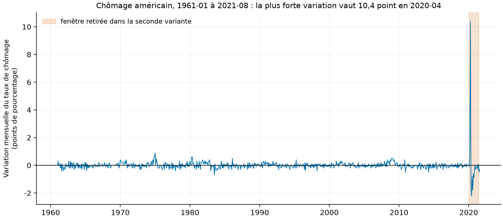
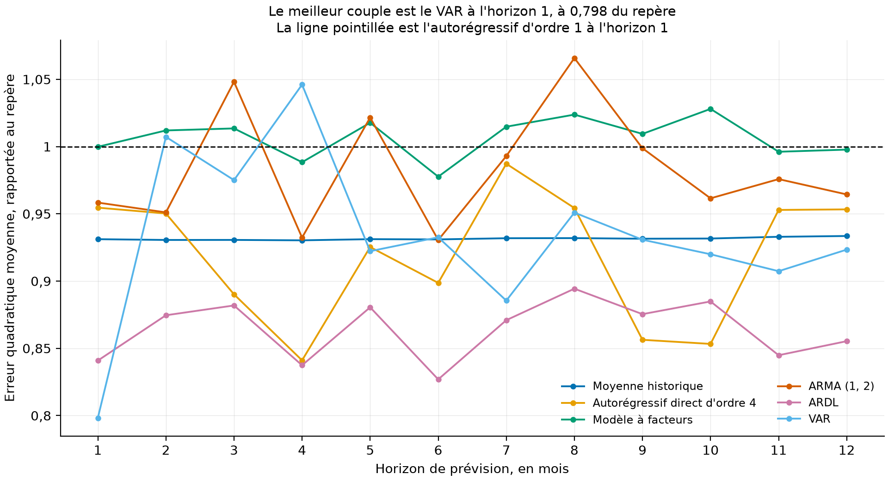
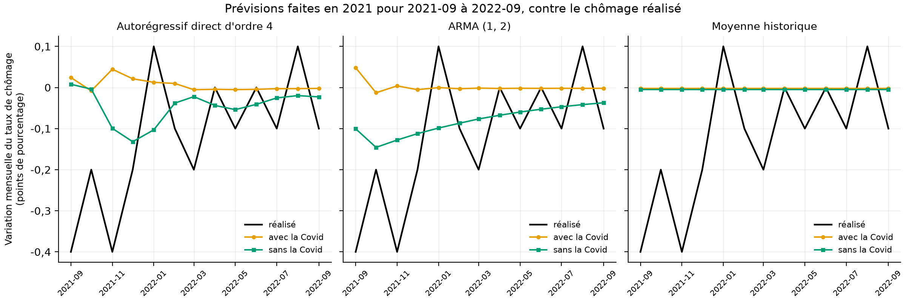

# Prévoir le chômage américain : six modèles, douze horizons, et le pari que 2021 laissait ouvert

Travail pratique d'équipe remis le 31 octobre 2021 à Philippe Goulet Coulombe, dans le cours
*Applications de modèles économiques* (ECO8086, UQAM), rendu ici reproductible : données
retéléchargées par script, ligne de commande, tests, CI, et chaque figure régénérable d'une commande.

[](https://github.com/Guilou001/uqam-prevision-facteurs/actions/workflows/ci.yml)


**Résultat en une phrase.** La réplication retrouve le travail de 2021 de près. L'autorégressif
direct d'ordre 4 à l'horizon 4 donne **0,841** contre 0,840 alors, et le **VAR à l'horizon 1 reste le
meilleur des six modèles**, à 0,798 du repère contre 0,822. Le travail laissait au temps une question,
faut-il retirer la Covid des données pour prévoir la suite. Cinq ans plus tard, la réponse est **oui
pour les trois modèles rejoués**, et l'écart va jusqu'à la moitié de l'erreur pour l'ARMA (0,020
contre 0,041).

*English summary.* Six models forecast the monthly change in the US unemployment rate over twelve
horizons, each re-estimated 732 times in a pseudo-out-of-sample exercise on 1961-2021 data. The
replication matches the 2021 coursework closely: the direct AR(4) at horizon 4 scores 0,841 against
0,840 then, and the VAR at horizon 1 remains the best of the six, 0,798 against 0,822, both relative
to an AR(1) benchmark. The work ended on an open question, whether to drop the Covid window when
forecasting ahead. The realised unemployment rate now answers it: dropping it was better for all
three models re-run, halving the error for the ARMA.

## 1. La question posée

Six façons de prévoir une même série se valent-elles, et laquelle survit une fois qu'on ne la juge
plus sur les données qui ont servi à l'estimer ?

En mots simples : si on essaie de deviner comment le chômage américain va bouger le mois prochain,
est-ce qu'un modèle compliqué fait mieux qu'une moyenne ?

La comparaison a un sens précis parce qu'un repère commun sert d'unité. Toutes les erreurs sont
divisées par celle d'un **autorégressif d'ordre 1 à l'horizon 1**, le modèle le plus simple qui
utilise le passé de la série. Un nombre sous 1 veut dire mieux que ce repère, un nombre au-dessus veut
dire pire.

## 2. La méthode et les conclusions de 2021

### Ce que le travail cherche, et sur quelles données

> Dans notre travail de prévision d'une variable macroéconomique, nous avons décidé de prévoir le
> chômage des États-Unis.
>
> D'autre part, ces données sont mensuelles, et disponible de février 1948 à Août 2021. Bien que
> l'échantillon soit disponible depuis les années 40, nous avons décidé de garder seulement les
> observations à partir de 1961. En effet, nous avons pris cette décision en raison de l'absence de
> certaines variables exogène indispensable à d'autres modèle de 1948 à 1961. Il est impératif de
> faire cela afin de comparer les modèles sur un pied d'égalité.
>
> Enfin, toujours dans une optique de description des données, on peut souligner que la première
> différence du chômage semble stationnaire d'ordre 2, à l'exception de la période de la Covid-19
> (2020-02 à 2021-06).

### Le protocole

> Dans cette première partie nous allons estimer et évaluer 3 modèles obligatoires, soit la moyenne
> historique, l'autorégressif direct et le modèle à facteur, ainsi que nos 3 meilleurs modèles
> optionnels qui sont ARMA, ARDL et VAR.
>
> Nos données d'entrainements sont de 1961-01 à 2014-12 inclusivement, et nos données pour le test (ou
> le pseudo out of sample) sont de 2015-01 à 2021-01 inclusivement. Il est important de noter que
> chaque modèle a été estimé 732 fois (61 périodes fois 12 horizons), de ce fait les données
> d'entrainements ont été rajoutés à chacune des 61 périodes. Les horizons sont modélisés simplement
> en modifiant les positions des inputs du modèle (sauf pour la moyenne historique). Enfin, dans une
> optique de faciliter la comparaison de la performance des modèles, toutes les MSE sont exprimés par
> leur rapport sur notre MSE benchmark qui est un AR(1) d'horizon 1.

### Les six modèles, et ce qu'ils ont donné

> Comme nous avons vu en cours, la moyenne historique rend quand même des résultats impressionnants
> bien qu'elle ne capture pas la variance de notre variable. En effet, elle minimise mieux les erreurs
> en moyenne que notre benchmark. On peut noter qu'en moyenne la moyenne historique à une MSE 10 point
> de pourcentage inférieur au benchmark.
>
> Le modèle autorégressif est une modélisation d'une série temporelle en fonction d'une constante et
> de ses valeurs passées. Afin de choisir le bon ordre de notre modèle autorégressif, nous avons
> comparé les modèles d'ordre 1 à 12 et gardé celui avec le meilleur BIC. Ainsi le meilleur modèle est
> un AR(4).
>
> Le modèle optimal utilise 2 composantes, les deux lags de la première composante et les 5 lags de la
> deuxième composante respectivement, ainsi qu'un lag de la série elle-même.
>
> On peut noter qu'en moyenne la performance du modèle à facteur est meilleur que le AR(1) benchmark.
> Toutefois, il est moins performant que les deux précédents modèles, à savoir la moyenne historique
> et l'autorégressif direct. Enfin, le meilleur horizon est h1 (0.938159).
>
> On remarque que le modèle ARMA (1,2) performe relativement moins bien que les précédents modèles
> présentés. Cependant il reste sensiblement meilleur que le AR(1) benchmark. Enfin le meilleur
> horizon est h4 (0.901306).
>
> On peut noter que le modèle ARDL performe relativement bien comparés aux précédents modèles
> présentés. En effet, en moyenne chacun de ses horizons est plus performant que le benchmark. Enfin
> le meilleur horizon est h1 (0.867007).
>
> On peut observer que le modèle VAR performe relativement bien comparés aux précédents modèles
> présentés. En effet, en moyenne chacun de ses horizons est plus performant que le benchmark.
> Également on peut préciser l'excellente performance de l'horizon h1 (0.821966) comparativement aux
> autres modèles.

### Le classement, et la faiblesse commune

> Ainsi, après avoir passés en revus plusieurs modèles afin de prédire la première différence du taux
> de chômage, on peut noter que les 3 meilleurs modèles comparativement au benchmark, sont : Le VAR
> h1, le AR(4) h4 et le ARDL h1. De surcroit, tous les modèles semblent bien minimiser la somme des
> erreurs mais, ne capture pas adéquatement notre variance de notre variable d'intérêt.
>
> On voit rapidement que les prévisions ont une variance beaucoup plus petite que les valeurs réelles.
> Également, celui qui capture le mieux la variance est le modèle VAR, comme on peut le voir avec les
> deux graphiques ci-dessous.

### La question laissée ouverte

> Dans cette partie, notre objectif est de faire du out-of-sample forecast de la première différence
> du taux de chômage américain pour la période de 2021-09 à 2022-09. Tous les meilleurs modèles
> présentés dans la section précédente ont été réestimés deux fois, la première avec les données de
> 1961-01 à 2021-08 et la deuxième avec cette même période mais en retirant a période d'extrême
> volatilité dû à la pandémie de covid-19. (2020-02 à 2021-06).
>
> Ce constat amène une question importante pour la prévision. Que devrions-nous faire des données
> résultats de black swan pour la prévision ? Il semble logique d'exclure ces valeurs aberrantes pour
> approximer le processus générateur de données. Pour confirmer ou infirmer cette hypothèse, il
> faudrait comparer ces deux cas à travers plusieurs modèles dans un exercice pseudo out of sample.
> Pour nos prévisions, il faudra attendre quelques mois pour voir la meilleure approche.

## 3. Les données, et ce qu'il a fallu rebâtir

Le carnet de 2021 lisait deux fichiers déposés à la main. Les deux se retéléchargent, l'un tel quel,
l'autre dans un millésime différent.

| Source | Contenu | Fenêtre retenue | Statut |
|---|---|---|---|
| FRED `UNRATE`, transformation `chg` | variation d'un mois à l'autre du taux de chômage américain | 1961-01 à 2021-08, 728 mois | mesuré |
| FRED-MD, millésime courant | 119 séries mensuelles américaines complètes sur la fenêtre, transformées par leur propre code | 1961-01 à 2021-08 | mesuré, millésime substitué |

Comment lire ce tableau, en trois constats. D'abord, les 728 mois retrouvent exactement la fenêtre du
travail. Les positions que le carnet de 2021 écrivait en clair, 155 pour janvier 1961 et 803 pour
janvier 2015, tombent sur les mêmes dates, et un test le vérifie. Ensuite, 119 des 126 séries de
FRED-MD sont complètes sur la fenêtre, les sept autres étant retirées. Enfin, le millésime de
septembre 2021, celui qu'avait le cours, n'est pas téléchargeable : l'adresse par millésime renvoie
une page d'erreur et l'archive officielle s'arrête en décembre 2014, deux constats mesurés le
2026-08-29. Le millésime courant sert de substitut, tronqué à août 2021, et ses valeurs anciennes sont
révisées.

**Une ambiguïté du travail, tranchée par ses propres chiffres.** Le texte de 2021 parle partout de
« la première différence du taux de chômage ». Mais la colonne du carnet s'appelle `UNRATE_PCH`, un
nom qui désigne la variation en pourcentage. Les deux ne sont pas la même chose : la première retranche le
taux du mois précédent, la seconde le divise. La moyenne historique publiée en 2021, -0,001925, est
celle de la différence première ; la variation en pourcentage donnerait un nombre d'un tout autre
ordre. Ce dépôt télécharge donc la différence première, et la moyenne obtenue sur les données
révisées, **-0,002060**, en est à un dix-millième.



Comment lire cette figure : chaque point est la variation du taux de chômage d'un mois à l'autre, en
points de pourcentage. La bande colorée est la fenêtre de février 2020 à juin 2021 que le travail met
de côté dans sa seconde variante. Le pic d'avril 2020 vaut à lui seul dix fois l'amplitude habituelle
de la série, ce qui explique pourquoi la question de le retirer se pose.

## 4. La méthode, pas à pas

1. **Choisir la variable à prévoir** : la variation mensuelle du taux de chômage, désaisonnalisée par
   la source et stationnaire, c'est-à-dire dont la moyenne et la variance ne dérivent pas dans le
   temps.
2. **Couper l'échantillon** : 1961-01 à 2014-12 pour l'apprentissage, soit 648 mois, puis 61 fenêtres
   de test qui commencent en 2015-01. À chaque fenêtre, un mois de plus entre dans l'apprentissage.
3. **Prévoir de façon directe.** Pour l'horizon h, le modèle ne garde que les retards h + 1 et
   suivants, puis prédit le mois qui suit la fin de sa fenêtre. Un modèle d'horizon 4 ne voit donc
   jamais les trois mois qui précèdent immédiatement ce qu'il prédit, et un test le vérifie en
   recomposant la prévision à la main depuis les quatre valeurs retardées.
4. **Répéter 732 fois par modèle**, 12 horizons fois 61 fenêtres.
5. **Estimer les six modèles** : la moyenne de tout le passé ; l'autorégressif direct d'ordre 4 ; le
   modèle à facteurs, qui résume les 119 séries de FRED-MD en deux composantes principales, les
   directions qui expliquent le plus de leur variation commune ; l'ARMA (1, 2) ; l'ARDL, qui ajoute
   les demandes d'assurance chômage et l'emploi salarié ; le VAR, qui traite le chômage et les
   demandes d'assurance chômage comme deux variables qui s'expliquent mutuellement.
6. **Rapporter chaque erreur à celle du repère**, l'autorégressif d'ordre 1 à l'horizon 1.

## 5. Ce que le portage a changé

| Ce que faisait le carnet de 2021 | Ce que fait ce dépôt | Pourquoi |
|---|---|---|
| positions de ligne écrites en clair (`155`, `803`, `864`) | dates (`1961-01`, `2015-01`, `2020-02`) | une série qui s'allonge décale toutes les positions ; les dates ne bougent pas |
| colonnes de FRED-MD désignées par leur rang (`iloc[:, 30:32]`) | désignées par leur nom (`CLAIMSx`, `PAYEMS`) | le rang d'une colonne dépend du millésime |
| deux fichiers déposés à la main | `pmf fetch` | le dépôt doit se rejouer ailleurs |
| `AutoReg(..., old_names=False)` | l'argument est retiré | il n'existe plus dans statsmodels |

## 6. Les résultats

Tous les chiffres viennent de `results/tables/`, et les figures se régénèrent par `pmf figures`.

### La table complète : erreur de chaque modèle, rapportée au repère

| Horizon | Moyenne historique | Autorégressif d'ordre 1 | Autorégressif direct d'ordre 4 | Modèle à facteurs | ARMA (1, 2) | ARDL | VAR |
|---|---:|---:|---:|---:|---:|---:|---:|
| 1 | 0,931 | 1,000 | 0,955 | 1,000 | 0,958 | 0,841 | **0,798** |
| 2 | 0,931 | 0,996 | 0,950 | 1,012 | 0,951 | 0,875 | 1,007 |
| 3 | 0,931 | 1,032 | 0,890 | 1,013 | 1,048 | 0,882 | 0,975 |
| 4 | 0,930 | 0,854 | 0,841 | 0,988 | 0,932 | 0,837 | 1,046 |
| 5 | 0,931 | 0,991 | 0,925 | 1,018 | 1,022 | 0,880 | 0,922 |
| 6 | 0,931 | 0,861 | 0,899 | 0,978 | 0,931 | **0,827** | 0,933 |
| 7 | 0,932 | 0,934 | 0,987 | 1,015 | 0,993 | 0,871 | 0,885 |
| 8 | 0,932 | 0,993 | 0,954 | 1,024 | 1,066 | 0,894 | 0,951 |
| 9 | 0,931 | 0,934 | 0,856 | 1,009 | 0,999 | 0,875 | 0,931 |
| 10 | 0,932 | 0,893 | 0,853 | 1,028 | 0,962 | 0,885 | 0,920 |
| 11 | 0,933 | 0,908 | 0,953 | 0,996 | 0,976 | 0,845 | 0,907 |
| 12 | 0,933 | 0,921 | 0,953 | 0,998 | 0,964 | 0,855 | 0,923 |
| **Moyenne** | **0,931** | 0,943 | 0,918 | 1,007 | 0,983 | **0,864** | 0,933 |

Comment lire ce tableau, en quatre constats. D'abord, cinq des six modèles battent le repère en
moyenne, et le sixième, le modèle à facteurs, fait pire : résumer 119 séries en deux composantes
n'aide pas à prévoir cette série-là. Ensuite, l'ARDL est le plus régulier, sous le repère aux douze
horizons et à 0,864 en moyenne. Le VAR, lui, alterne entre le meilleur score du tableau à l'horizon 1
et un score au-dessus du repère à l'horizon 4. Puis, la moyenne historique tient une ligne
presque plate autour de 0,931 : ne rien modéliser du tout coûte 7 % de moins que le repère. Enfin,
l'écart entre le meilleur et le pire modèle vaut 0,21, ce qui est petit au regard de 61 mois de test.
Le travail de 2021 le disait déjà, en proposant des tests statistiques comme extension.



Comment lire cette figure : une courbe par modèle, l'horizon en abscisse, l'erreur rapportée au repère
en ordonnée. La ligne pointillée à 1 est le repère lui-même. La ligne bleue presque horizontale est la
moyenne historique, qui ne dépend pas de l'horizon. Les courbes qui zigzaguent sont celles des modèles
estimés, et leur zigzag mesure surtout le bruit de l'exercice, pas une propriété des horizons.

### Ce que 2021 rapporte, et ce que 2026 retrouve

| Constat de 2021 | 2021 | 2026 | Écart |
|---|---:|---:|---:|
| Autorégressif direct d'ordre 4, horizon 4 | 0,840 | 0,841 | 0,001 |
| VAR, horizon 1 | 0,822 | 0,798 | -0,024 |
| ARDL, horizon 1 | 0,867 | 0,841 | -0,026 |
| ARMA, horizon 4 | 0,901 | 0,932 | 0,031 |
| Modèle à facteurs, horizon 1 | 0,938 | 1,000 | 0,062 |
| Moyenne historique, écart moyen au repère | 10 points | 6,9 points | 3,1 points |

Comment lire ce tableau, en trois constats. Le premier est que l'autorégressif direct tombe à un
millième près, ce qui est le meilleur résultat possible pour une réplication faite sur des données
révisées et un millésime de FRED-MD différent. Le deuxième est que le VAR reste le meilleur modèle du
lot dans les deux versions, et qu'il s'améliore même de 0,024. Le troisième est que le modèle à
facteurs est celui qui bouge le plus, ce qui était prévisible. C'est le seul dont les entrées
dépendent entièrement du millésime substitué, et il passe de 0,938 au niveau exact du repère.

Le classement de tête change en partie. Le travail de 2021 retenait « le VAR h1, le AR(4) h4 et le
ARDL h1 ». En 2026 le trio devient le VAR à l'horizon 1 (0,798), l'ARDL à l'horizon 6 (0,827) et
l'ARDL à l'horizon 4 (0,837), l'autorégressif direct tombant quatrième à 0,841. Les quatre
premiers tiennent dans 0,043, soit moins que l'écart entre deux horizons voisins d'un même modèle.

### Le pari de 2021, et sa réponse

Le travail se terminait sur une question et un délai : faut-il retirer la Covid des données, et « il
faudra attendre quelques mois pour voir la meilleure approche ». Les mois ont passé. Le chômage
réalisé de septembre 2021 à septembre 2022 est maintenant connu, et il tranche.

| Modèle | Avec la Covid | Sans la Covid | Ce que le retrait fait gagner |
|---|---:|---:|---:|
| Moyenne historique | 0,0380 | 0,0372 | 2 % |
| Autorégressif direct d'ordre 4 | 0,0430 | 0,0314 | 27 % |
| ARMA (1, 2) | 0,0412 | 0,0204 | 50 % |

Comment lire ce tableau, en trois constats. Le premier répond à la question de 2021 : retirer la
fenêtre de la Covid était le bon choix, pour les trois modèles rejoués, et l'intuition du travail
était donc juste. Le deuxième est que le gain croît avec la mémoire du modèle. Il est nul pour la moyenne historique,
qui dilue les dix-sept mois dans sept cents, et de moitié pour l'ARMA, dont les paramètres pèsent
surtout les mois récents. Le troisième est plus embarrassant pour les six
modèles à la fois. Leur erreur moyenne est positive dans les six cas, de +0,04 à +0,13 point : aucun
n'a vu que le chômage continuerait de baisser aussi vite en 2022.

Trois modèles sur six sont rejoués, ceux qui ne demandent aucune prévision auxiliaire. Le modèle à
facteurs, l'ARDL et le VAR auraient besoin qu'on prévoie d'abord leurs propres variables explicatives,
ce que le carnet de 2021 faisait par des ARMA auxiliaires ; ils ne sont pas prolongés ici.



Comment lire cette figure : un cadre par modèle, la courbe noire étant le chômage réellement observé,
les deux autres les prévisions faites en 2021 avec et sans la fenêtre de la Covid. Les prévisions sont
presque plates quand le réalisé oscille entre -0,4 et +0,1 point. C'est la faiblesse que le travail de
2021 signalait lui-même, « les prévisions ont une variance beaucoup plus petite que les valeurs
réelles ». La courbe verte, sans la Covid, passe sous la jaune dans les trois cadres, et c'est ce
décalage vers le bas qui la rapproche du réalisé.

## 7. Reproduire

```bash
uv sync --locked --all-extras
uv run pytest             # 11 tests fermés, sans réseau
uv run pmf fetch          # deux fichiers sources, environ 0,7 Mo
uv run pmf bases          # la fenêtre et le découpage
uv run pmf lab            # les six modèles, 732 estimations chacun
uv run pmf futur          # les prévisions de 2021, contre le réalisé
uv run pmf figures        # les trois figures
```

Durées mesurées sur un processeur Apple M5 Pro : **90 secondes** pour `pmf lab`, dont 62 pour l'ARMA,
qui est le seul modèle à réestimer une vraisemblance complète à chacune des 732 fenêtres. Les autres
commandes prennent quelques secondes.

## 8. Limites, avec leur statut

| Limite | Statut |
|---|---|
| Le millésime de FRED-MD de septembre 2021 n'est pas téléchargeable, l'archive officielle s'arrêtant en décembre 2014 | mesuré le 2026-08-29 ; le millésime courant sert de substitut et le modèle à facteurs est celui qui en dépend le plus |
| Les valeurs du chômage sont révisées depuis 2021 | mesuré : la moyenne historique passe de -0,001925 à -0,002060, soit un écart d'un dix-millième |
| Le texte de 2021 annonce un test de 2015-01 à 2021-01, alors que son code et ses figures s'arrêtent en 2020-01 | mesuré ; les 61 fenêtres du code sont retenues, comme dans les figures du travail |
| Les ordres des modèles (AR(4), ARMA (1, 2), les retards de l'ARDL) sont ceux que le BIC retenait en 2021, repris tels quels | déclaré ; les resélectionner sur les données révisées changerait la comparaison plus que le passage du temps |
| Aucun test statistique ne distingue les modèles entre eux | reconnu ; le travail de 2021 le proposait déjà comme extension, et les quatre premiers couples tiennent dans 0,043 |
| La moyenne historique de l'horizon h s'arrête h mois plus tôt que les autres modèles | reconnu ; c'est un raccourci du carnet de 2021, conservé pour rester fidèle, et il avantage à peine la moyenne aux grands horizons |
| Trois des six modèles seulement sont prolongés jusqu'en 2022 | déclaré ; les trois autres exigeraient de prévoir leurs propres variables explicatives |
| Un seul pays, une seule variable, un seul découpage | déclaré |

## 9. Crédits, licence, citation

Travail d'équipe réalisé par **Guillaume Vaudescal et Philippe Tousignant**, remis le 31 octobre 2021.
Cours ECO8086, *Applications de modèles économiques*, donné par Philippe Goulet Coulombe à l'UQAM. Le
portage sur statsmodels 0.14, le téléchargement par script, les tests, la CI et le prolongement
jusqu'en 2022 datent de 2026.

Code sous licence MIT.

## 10. Références

- Kuma, J. K. (2018), *Modélisation ARDL, test de cointégration aux bornes et approche de
  Toda-Yamamoto*, Congo-Kinshasa, cel-01766214.
- Marcellino, M. (2017), *An introduction to factor modelling*, université Bocconi.
- McCracken, M. W. et Ng, S. (2016), « FRED-MD: a monthly database for macroeconomic research »,
  *Journal of Business and Economic Statistics*, vol. 34, n° 4, p. 574-589.
- U.S. Bureau of Labor Statistics, *Unemployment Rate* [UNRATE], FRED, Federal Reserve Bank of
  St. Louis, https://fred.stlouisfed.org/series/UNRATE.
